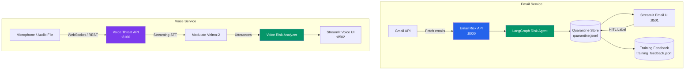
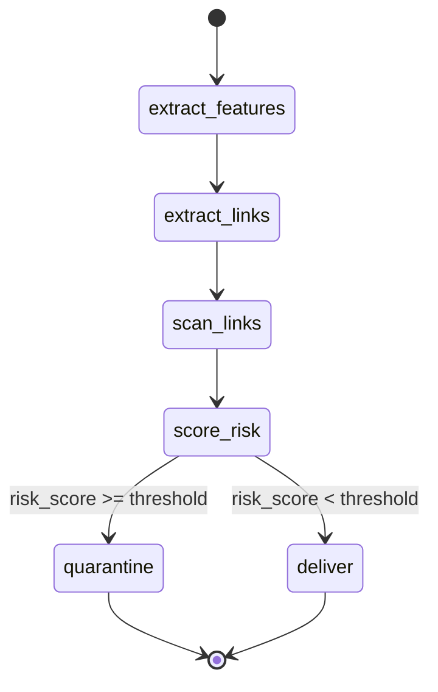
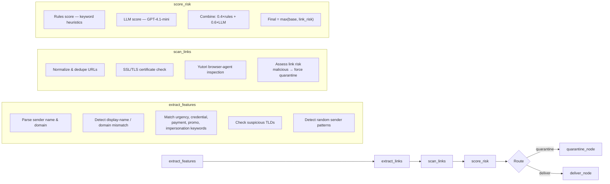
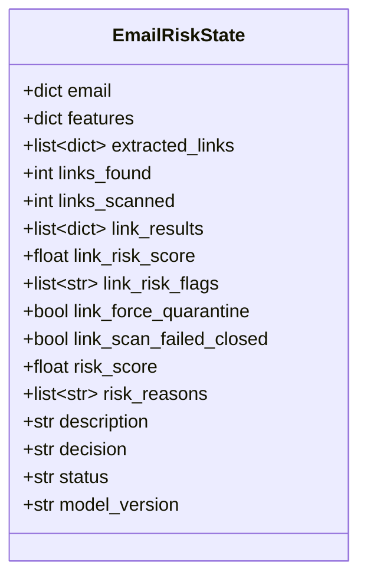
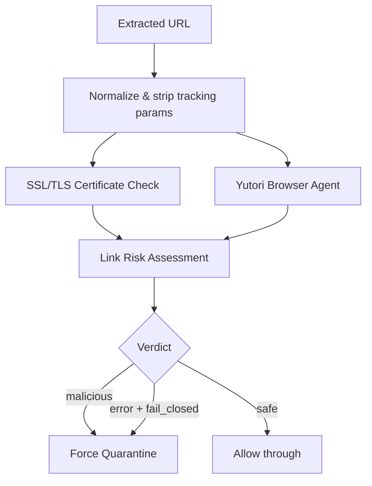
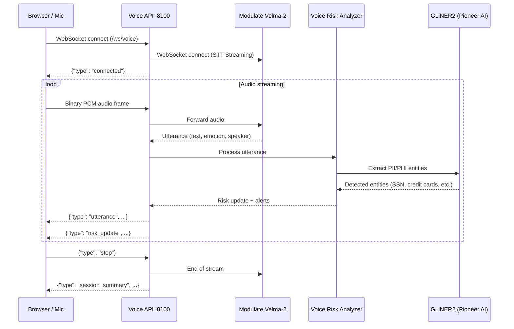
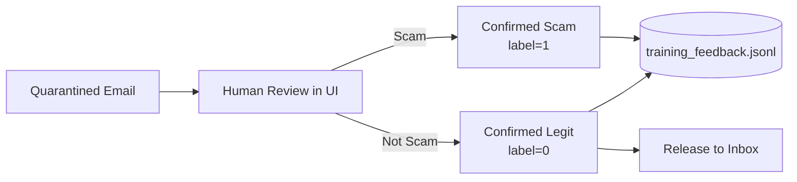

# AI Email Risk Agent & Voice Threat Monitor

An AI-powered security platform that detects phishing emails and social-engineering voice threats in real time.

Two independent services:

| Service | Port | Description |
|---------|------|-------------|
| **Email Risk API** | 8000 | Gmail-connected phishing detection with LangGraph agent |
| **Email Frontend** | 8501 | Streamlit UI — inbox, quarantine, HITL labeling |
| **Voice Threat API** | 8100 | Real-time voice scam detection via Modulate Velma-2 |
| **Voice Frontend** | 8502 | Streamlit UI — mic capture, batch upload, risk dashboard |
| **LangGraph Studio** | 2024 | Optional — visual workflow debugger |

---

## Tech Stack

### Core Frameworks
- **[FastAPI](https://fastapi.tiangolo.com/)** — High-performance async REST APIs
- **[Streamlit](https://streamlit.io/)** — Rapid frontend prototyping
- **[LangGraph](https://langchain-ai.github.io/langgraph/)** — Stateful agent orchestration
- **[LangChain](https://python.langchain.com/)** — LLM application patterns
- **[Pydantic](https://docs.pydantic.dev/)** — Data validation & serialization

### AI & ML Services
- **[OpenAI GPT-4.1-mini](https://platform.openai.com/)** — LLM-based email risk scoring
- **[Modulate Velma-2](https://www.modulate.com/)** — Real-time speech-to-text with emotion detection
- **[GLiNER2](https://www.pioneeraiagents.com/)** (Pioneer AI) — Named Entity Recognition for PII/PHI extraction (SSN, credit cards, medical records, bank accounts)
- **[Yutori](https://yutori.com/)** — Browser-agent for website phishing detection
- **[LangSmith](https://smith.langchain.com/)** — LLM tracing & observability (optional)

### Email Integration
- **[Gmail API](https://developers.google.com/gmail/api)** — OAuth2-authenticated email operations
  - `gmail.modify` — Read, trash, modify labels
  - `gmail.send` — Send emails

### Python Libraries
| Library | Purpose |
|---------|---------|
| `uvicorn` | ASGI server for FastAPI |
| `httpx` | Async HTTP client for external APIs |
| `websockets` | WebSocket client/server (Modulate streaming) |
| `python-multipart` | File upload handling |
| `python-dotenv` | Environment variable management |
| `requests` | HTTP client for Gmail API |
| `openai` | OpenAI SDK |
| `langchain-openai` | LangChain-OpenAI integration |
| `gliner` | GLiNER2 NER model for PII/PHI extraction |

### Data Persistence
- **JSONL files** — Lightweight append-only storage
  - `data/quarantine.jsonl` — Quarantined email records
  - `data/training_feedback.jsonl` — HITL label feedback

### Development Tools
- **pytest** — Testing framework
- **LangGraph Studio** — Visual workflow debugger

---

## Architecture Overview



---

## Email Risk Agent — LangGraph Pipeline

The core email risk engine is a multi-node LangGraph state machine that evaluates every incoming email through deterministic rules, LLM scoring, and website trust verification.

### Agent Graph



### Agent Nodes (Detail)



### State Schema



### Scoring Modes

| Mode | Formula | Fallback |
|------|---------|----------|
| `hybrid` (default) | `0.4 × rules + 0.6 × LLM` | Rules-only if LLM fails |
| `rules_only` | Deterministic keyword scoring | — |
| `llm_only` | LLM classification | Quarantine if `RISK_FAIL_CLOSED=true` |

### Keyword Detection Rules

| Category | Examples |
|----------|----------|
| **Urgency** | `urgent`, `immediately`, `action required`, `final notice`, `expires today` |
| **Credential Phishing** | `verify your account`, `reset password`, `login`, `OTP`, `SSN` |
| **Payment Fraud** | `wire transfer`, `gift card`, `invoice attached`, `crypto payment` |
| **Promo Scam** | `bonus offer`, `free spins`, `jackpot`, `casino`, `no deposit` |
| **Impersonation** | `CEO`, `finance team`, `HR team`, `support team` |
| **Suspicious TLDs** | `.top`, `.xyz`, `.biz`, `.click`, `.shop`, `.work`, `.zip` |

### Link Scan Pipeline



---

## Voice Threat Monitor — Modulate Velma-2

A separate service that detects social-engineering attacks in voice calls using Modulate's Velma-2 speech-to-text with emotion detection and GLiNER2 Named Entity Recognition for PII/PHI extraction.

### Voice Pipeline



### Voice Risk Signals

The voice analyzer reuses the same keyword rules from the email engine and adds voice-specific signals:

| Signal | Weight | Description |
|--------|--------|-------------|
| Urgency keywords | 0.15 | Same set as email rules |
| Credential keywords | 0.20 | Password, SSN, verify account |
| Payment keywords | 0.20 | Wire transfer, gift card |
| Promo scam keywords | 0.12 | Bonus, jackpot, casino |
| Impersonation keywords | 0.15 | CEO, HR team, support |
| High-risk emotions | 0.15 | Angry, fearful, aggressive, distressed |
| Moderate-risk emotions | 0.08 | Anxious, frustrated, nervous |
| PII/PHI detection | 0.40 | GLiNER2 NER for SSN, credit cards, medical records, bank accounts |

Decisions: `safe` (< 0.65) · `suspicious` (0.65–0.85) · `threat` (≥ 0.85)

---

## HITL (Human-in-the-Loop) Workflow



---

## Project Structure

```
├── backend/
│   ├── app/
│   │   ├── api.py                  # Email Risk API (FastAPI)
│   │   ├── gmail_client.py         # Gmail API client
│   │   ├── gmail_service.py        # Gmail service layer
│   │   ├── schemas.py              # Pydantic models — email
│   │   ├── modulate_client.py      # Modulate Velma-2 client (WS + REST)
│   │   ├── voice_risk_analyzer.py  # Voice-specific risk scoring
│   │   ├── voice_schemas.py        # Pydantic models — voice
│   │   └── risk_agent/
│   │       ├── graph.py            # LangGraph state machine
│   │       ├── rules.py            # Deterministic keyword rules
│   │       ├── llm.py              # GPT-4.1-mini risk scorer
│   │       ├── links.py            # URL extraction & normalization
│   │       ├── ssl_check.py        # SSL/TLS certificate verification
│   │       ├── link_scoring.py     # Link risk assessment
│   │       ├── yutori_client.py    # Yutori browser-agent client
│   │       ├── service.py          # RiskService orchestrator
│   │       ├── store.py            # Quarantine JSONL store
│   │       └── state.py            # EmailRiskState TypedDict
│   └── voice_api.py                # Voice Threat API (FastAPI, standalone)
├── frontend/
│   ├── streamlit_app.py            # Email UI (inbox + quarantine)
│   └── voice_app.py                # Voice UI (mic + batch upload)
├── data/
│   ├── quarantine.jsonl            # Quarantined email records
│   └── training_feedback.jsonl     # HITL label feedback
├── tests/                          # pytest test suite
├── scripts/
│   ├── setup_gmail.py              # Gmail OAuth setup
│   └── batch_test_live.py          # Batch email testing
├── spec.md                         # Full technical specification
├── run.sh                          # Launches all services
├── langgraph.json                  # LangGraph Studio config
└── requirements-webapp.txt         # Python dependencies
```

---

## Setup

### Prerequisites

- Python 3.13+
- Gmail OAuth credentials (see [GMAIL_SETUP.md](GMAIL_SETUP.md))
- OpenAI API key (for LLM risk scoring)
- Modulate API key (for voice features)

### Install

```bash
cd /Users/pramodthebe/Desktop/websecurity
python -m venv .venv-webapp313
source .venv-webapp313/bin/activate
pip install -r requirements-webapp.txt
```

### Configure

```bash
cp .env.example .env
```

Key environment variables:

| Variable | Required | Description |
|----------|----------|-------------|
| `OPENAI_API_KEY` | Recommended | GPT-4.1-mini for email risk scoring |
| `MODULATE_API_KEY` | For voice | Modulate Velma-2 API key |
| `RISK_DECISION_MODE` | No | `hybrid` / `rules_only` / `llm_only` |
| `RISK_THRESHOLD` | No | Quarantine threshold (default: `0.65`) |
| `RISK_LINK_SCAN_ENABLED` | No | Enable URL scanning (default: `true`) |
| `RISK_LINK_SCAN_FAIL_CLOSED` | No | Quarantine on scan error (default: `true`) |
| `YUTORI_API_KEY` | For link scans | Yutori browser-agent key |

---

## Run

Launch all services with one command:

```bash
source .venv-webapp313/bin/activate
bash run.sh
```

This starts:
- Email API on `http://127.0.0.1:8000`
- Email UI on `http://127.0.0.1:8501`
- Voice API on `http://127.0.0.1:8100`
- Voice UI on `http://127.0.0.1:8502`
- LangGraph Studio on `http://127.0.0.1:2024` (optional)

Or run services individually:

```bash
# Email backend
uvicorn backend.app.api:app --reload --port 8000

# Email frontend
streamlit run frontend/streamlit_app.py --server.port 8501

# Voice backend
uvicorn backend.voice_api:app --reload --port 8100

# Voice frontend
VOICE_API_URL=http://127.0.0.1:8100 streamlit run frontend/voice_app.py --server.port 8502
```

---

## API Reference

### Email Risk API (`:8000`)

| Method | Endpoint | Description |
|--------|----------|-------------|
| `GET` | `/health` | Health check |
| `GET` | `/gmail/emails` | List inbox emails |
| `POST` | `/gmail/send` | Send email |
| `DELETE` | `/gmail/emails/{id}` | Delete email |
| `POST` | `/risk/emails/evaluate` | Run risk agent on email |
| `POST` | `/risk/links/evaluate` | Evaluate URLs independently |
| `GET` | `/risk/quarantine` | List quarantined emails |
| `GET` | `/risk/quarantine/{id}` | Get quarantine detail |
| `POST` | `/risk/quarantine/{id}/label` | HITL label (scam/legit) |
| `POST` | `/risk/quarantine/{id}/release` | Release from quarantine |

### Voice Threat API (`:8100`)

| Method | Endpoint | Description |
|--------|----------|-------------|
| `GET` | `/health` | Health + Modulate config status |
| `WS` | `/ws/voice` | Real-time voice streaming (PCM 16-bit 16kHz) |
| `POST` | `/voice/analyze` | Batch audio upload + analysis |

---

## Tests

```bash
source .venv-webapp313/bin/activate
pytest tests/ -v
```

---

## License

Private — all rights reserved.
