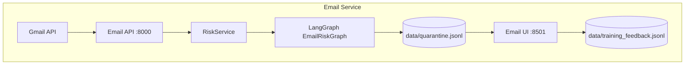
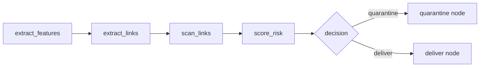
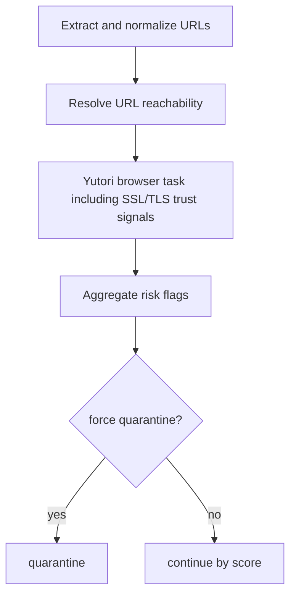

# AI Email Risk Agent

This repository now centers on a quarantine-first email security platform:

- Gmail integration via the existing OAuth/env setup
- Background screening of incoming mail before review
- AI risk scoring plus Yutori browser-use research for suspicious messages
- Quarantine, confirmed scam, and manual investigation workflows
- Next.js operator UI over the FastAPI backend

The app is built with FastAPI + LangGraph on the backend and Next.js on the frontend.

## Services

| Service | Default URL | Purpose |
| --- | --- | --- |
| Email API | `http://127.0.0.1:8000` | Gmail operations, screening, quarantine, scam, manual check APIs |
| Next.js UI | `http://127.0.0.1:3000` | Dashboard, Quarantine, Scam, Manual Check |
| LangGraph dev server (optional) | `http://127.0.0.1:2024` | Graph debugging and Studio integration |

## High-Level Architecture


```mermaid
graph TB
    subgraph Email Service
        Gmail[Gmail API] --> EmailAPI[Email API :8000]
        EmailAPI --> RiskService[RiskService]
        RiskService --> RiskGraph[LangGraph EmailRiskGraph]
        RiskGraph --> Quarantine[(data/quarantine.jsonl)]
        Quarantine --> EmailUI[Email UI :8501]
        EmailUI --> Feedback[(data/training_feedback.jsonl)]
    end

```

## Email Agent Architecture (LangGraph)


```mermaid
flowchart LR
    A[extract_features] --> B[extract_links]
    B --> C[scan_links]
    C --> D[score_risk]
    D --> E{decision}
    E -->|quarantine| F[quarantine node]
    E -->|deliver| G[deliver node]
```

### Email scoring model

1. Deterministic rule score from sender/text features (`rules.py`).
2. Optional Pioneer classifier score (`llm.py`).
3. Decision mode:
- `rules_only`: use rules score.
- `hybrid`: `0.4 * rules + 0.6 * llm` (falls back to rules if LLM unavailable).
- `llm_only`: use LLM score; if unavailable and `RISK_FAIL_CLOSED=true`, force score `1.0`.
4. Link score override: final score is `max(base_score, link_risk_score)` when links were scanned.
5. Force quarantine if link assessment marks `force_quarantine=true`.

### Deterministic phishing features

- Company display-name vs sender-domain mismatch.
- Urgency language.
- Credential phishing patterns.
- Payment fraud patterns.
- Promotional scam lure patterns.
- Impersonation keywords.
- Suspicious sender TLDs.
- Randomized sender domain/local-part heuristics.

### Link scanning pipeline


```mermaid
flowchart TD
    L1[Extract and normalize URLs] --> L2[Resolve URL reachability]
    L2 --> L3[Yutori browser task including SSL/TLS trust signals]
    L3 --> L5[Aggregate risk flags]
    L5 --> L6{force quarantine?}
    L6 -->|yes| L7[quarantine]
    L6 -->|no| L8[continue by score]
```

Link risk can be raised by:
- Yutori verdict (`malicious`, `suspicious`, `unknown`)
- Unreachable link
- Timeout/error (optionally fail-closed)
- Invalid SSL on HTTPS URLs (force quarantine)
- Unknown SSL state on HTTPS URLs (suspicious score floor `0.55`, no force quarantine by itself)

## Repository Layout

```text
backend/
  api.py
  app/
    api.py
    gmail_client.py
    gmail_service.py
    schemas.py
    risk_agent/
      email_parsing.py
      graph.py
      link_scoring.py
      links.py
      llm.py
      rules.py
      service.py
      ssl_check.py
      state.py
      store.py
      studio_graph.py
      yutori_client.py
frontend/
  streamlit_app.py
frontend-next/
  app/
  components/
  lib/
scripts/
  setup_gmail.py
  batch_test_live.py
  batch_test_random_links.py
data/
  quarantine.jsonl
  training_feedback.jsonl
tests/
run.sh
langgraph.json
requirements-webapp.txt
.env.example
```

## Setup

### 1) Create and activate virtualenv

```bash
cd /Users/pramodthebe/Desktop/websecurity
python3.13 -m venv .venv-webapp313
source .venv-webapp313/bin/activate
python -m pip install --upgrade pip
```

### 2) Install backend dependencies

```bash
python -m pip install -r requirements-webapp.txt
```

The Gmail integration imports Google client packages directly, so install these too if they are not already in your environment:

```bash
python -m pip install google-api-python-client google-auth-oauthlib
```

### 3) Configure environment

```bash
cp .env.example .env
```

### 4) Configure Gmail OAuth (for Gmail endpoints/UI)

- Put OAuth client JSON at `.secrets/secrets.json`.
- Run:

```bash
python scripts/setup_gmail.py
```

This creates `.secrets/token.json`.

See also [GMAIL_SETUP.md](/Users/pramodthebe/Desktop/websecurity/GMAIL_SETUP.md).

### 3) Install frontend dependencies

```bash
cd /Users/pramodthebe/Desktop/websecurity/frontend-next
npm install
```

## Runtime

### Start all services

```bash
source .venv-webapp313/bin/activate
bash run.sh
```
- `--no-studio`
- `--tunnel`

Runtime logs are written under `.run-logs/`.

### Start services individually

```bash
# Email API
uvicorn backend.api:app --host 127.0.0.1 --port 8000 --reload

# Email UI
EMAIL_ASSISTANT_API=http://127.0.0.1:8000 \
streamlit run frontend/streamlit_app.py --server.address 127.0.0.1 --server.port 8501

# LangGraph dev server
langgraph dev --config langgraph.json --host 127.0.0.1 --port 2024 --no-browser
```

## API Reference

### Email API (`:8000`)

| Method | Endpoint | Purpose |
| --- | --- | --- |
| `GET` | `/health` | Health check |
| `GET` | `/gmail/emails` | List Gmail messages |
| `POST` | `/gmail/send` | Send email |
| `DELETE` | `/gmail/emails/{message_id}` | Move message to trash |
| `POST` | `/risk/emails/evaluate` | Run full risk evaluation |
| `POST` | `/risk/links/evaluate` | Evaluate links without full email fetch path |
| `GET` | `/risk/quarantine` | List quarantine records (excluding released) |
| `GET` | `/risk/quarantine/{message_id}` | Get single quarantine record |
| `POST` | `/risk/quarantine/{message_id}/label` | Label record (`0` legit, `1` scam) |
| `POST` | `/risk/quarantine/{message_id}/release` | Release from quarantine |

### Sample payload: email evaluation

```json
{
  "email": {
    "id": "msg-1",
    "thread_id": "thread-1",
    "from_email": "PayPal Support <alerts@review-center.biz>",
    "to_email": "user@example.com",
    "subject": "Urgent account verification",
    "body": "Immediate action required. Verify your account password.",
    "send_time": "Fri, 27 Feb 2026 12:00:00 +0000",
    "headers": null
  }
}
```

### Sample payload: link-only evaluation

```json
{
  "sender_email": "alerts@example.com",
  "subject": "Security update",
  "body": "Please review https://example.com",
  "urls": ["https://example.com"]
}
```

### LinkScanResult SSL/TLS fields

`/risk/emails/evaluate` and `/risk/links/evaluate` now expose:
- `ssl_state`: `valid` | `invalid` | `unknown`
- `ssl_source`: provider/source for SSL trust signal (currently `yutori`)

Compatibility fields remain:
- `ssl_valid`
- `ssl_issuer`
- `ssl_subject`
- `ssl_expires_at`
- `ssl_hostname_match`

Semantic note:
- `ssl_valid=true` only when `ssl_state=valid`.
- `ssl_valid=false` can mean either `ssl_state=invalid` or `ssl_state=unknown`; use `ssl_state` for exact behavior.

## Environment Variables

### App wiring

| Variable | Default |
| --- | --- |
| `EMAIL_ASSISTANT_API` | `http://127.0.0.1:8000` |
| `GMAIL_ACCOUNT` | empty |
| `EMAIL_DEFAULT_TO` | empty |

### Email risk engine

| Variable | Default |
| --- | --- |
| `RISK_THRESHOLD` | `0.65` |
| `RISK_DECISION_MODE` | `hybrid` |
| `RISK_FAIL_CLOSED` | `false` |
| `RISK_MODEL_VERSION` | `risk-agent-v1` |
| `RISK_LLM_ENABLED` | `true` |
| `RISK_LLM_MODEL` | code default `gpt-4.1-mini`; `.env.example` currently uses a Pioneer job-id value |
| `RISK_LLM_API_URL` | `https://api.pioneer.ai/gliner-2/custom` |
| `RISK_LLM_API_KEY` | empty |
| `RISK_LLM_JOB_ID` | from `RISK_LLM_MODEL` |
| `RISK_LLM_TASK` | `classify_text` |
| `RISK_LLM_SCHEMA_CATEGORIES` | `scam,legitimate` |
| `RISK_LLM_THRESHOLD` | `0.5` |
| `RISK_LLM_TIMEOUT_SECONDS` | `20` |

### Link scanning

| Variable | Default |
| --- | --- |
| `RISK_LINK_SCAN_ENABLED` | `true` |
| `RISK_LINK_SCAN_MAX_URLS` | `3` |
| `RISK_LINK_SCAN_TIMEOUT_SECONDS` | `20` |
| `RISK_LINK_SCAN_FAIL_CLOSED` | `true` |
| `RISK_LINK_SCAN_ALLOW_HTTP` | `false` |
| `YUTORI_API_KEY` | empty |
| `YUTORI_BASE_URL` | `https://api.yutori.com/v1` |
| `YUTORI_BROWSE_MAX_STEPS` | `20` |
| `YUTORI_BROWSE_PATH` | `/browsing/tasks` |
| `YUTORI_BROWSE_RESULT_PATH` | `/browsing/tasks/{task_id}` |
| `YUTORI_POLL_TIMEOUT_SECONDS` | `90` |

### Persistence

| Variable | Default |
| --- | --- |
| `RISK_QUARANTINE_PATH` | `data/quarantine.jsonl` |
| `RISK_FEEDBACK_PATH` | `data/training_feedback.jsonl` |

### `run.sh` host/port overrides

- `VENV_PATH`
- `BACKEND_HOST`, `BACKEND_PORT`
- `FRONTEND_HOST`, `FRONTEND_PORT`
- `LANGGRAPH_HOST`, `LANGGRAPH_PORT`

## Data and HITL workflow

- Quarantine records are append-only writes to `data/quarantine.jsonl`.
- Human labels append to `data/training_feedback.jsonl`.
- Listing quarantine excludes records with `status="released"`.
- Re-evaluating an existing message id uses stored state.
- Stored statuses `pending_human_review` and `confirmed_scam` return `quarantine`.
- Stored statuses `confirmed_legit` and `released` return `deliver`.

## Testing

Run from repository root:

```bash
source .venv-webapp313/bin/activate
python -m pytest -q
```

In this environment, invoking `.venv-webapp313/bin/pytest` directly may require `PYTHONPATH=.`:

```bash
PYTHONPATH=. .venv-webapp313/bin/pytest -q
```

Current suite passes:
- 49 tests passed locally.

## License

Private repository. All rights reserved.
