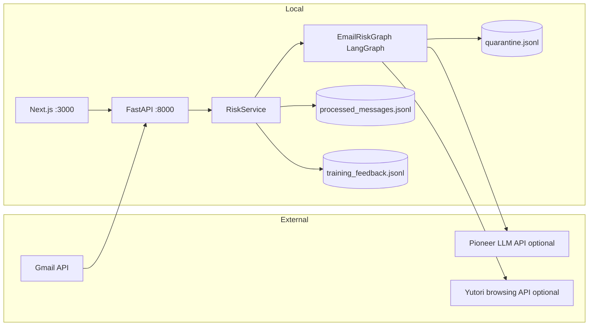
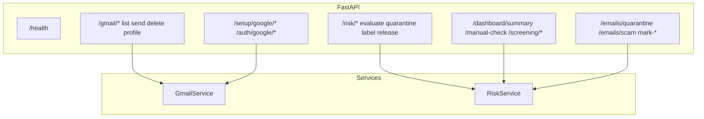
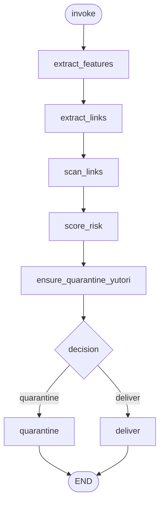
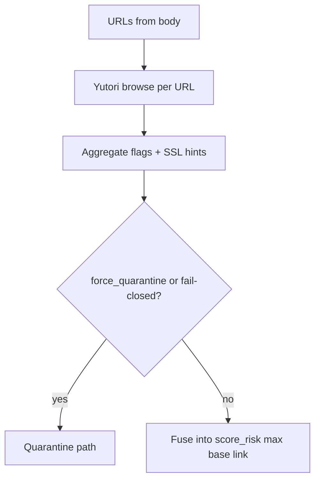

# AI Email Risk Agent

A **quarantine-first email security demo** you run locally. It connects to **Gmail**, screens messages with a **LangGraph risk pipeline** (rules + optional LLM + optional link browsing via **Yutori**), writes risky mail to a local **quarantine journal**, and exposes a **Next.js operator dashboard** backed by **FastAPI**.

The goal is operator-grade review: suspicious mail is held for human judgment (legit vs scam, release flows) while keeping a simple path for developers to wire their own Google Cloud OAuth project and API keys.

---

## What the platform does

1. **Gmail access** — List inbox mail, send mail, trash messages, using OAuth2 credentials stored under `.secrets/` (or env vars).
2. **Risk evaluation** — Each message passes through a compiled **LangGraph** workflow: extract typed features, extract URLs, optionally scan links (HTTP reachability + Yutori browser verdict + TLS hints), fuse rule-based and LLM scores, then decide **quarantine** vs **deliver**.
3. **Background screening** — While the API runs, an optional background loop periodically pulls recent inbox messages for the configured mailbox, skips already-processed IDs (`data/processed_messages.jsonl`), and invokes the same evaluator.
4. **Human review** — Quarantined items become **`pending_human_review`** records in `data/quarantine.jsonl`. Labels append to `data/training_feedback.jsonl`. The UI surfaces quarantine, confirmed scam, and manual investigation tools.

---

## Stack at a glance

| Component | Default URL | Role |
| --- | --- | --- |
| FastAPI app (`uvicorn backend.api:app`) | `http://127.0.0.1:8000` | Gmail, OAuth redirects, risk APIs, screening |
| Next.js (`frontend-next`) | `http://127.0.0.1:3000` | Dashboard, setup, quarantine / scam workflows |
| LangGraph dev (optional, via `run.sh`) | `http://127.0.0.1:2024` | Studio / graph debugging |

---

## System architecture

High-level data flow from Gmail through the backend and UI:


```mermaid
flowchart LR
  subgraph External
    Gmail[Gmail API]
    Pioneer[Pioneer LLM API optional]
    Yutori[Yutori browsing API optional]
  end

  subgraph Local
    API[FastAPI :8000]
    RS[RiskService]
    G[EmailRiskGraph LangGraph]
    Q[(quarantine.jsonl)]
    P[(processed_messages.jsonl)]
    F[(training_feedback.jsonl)]
    UI[Next.js :3000]
  end

  Gmail --> API
  API --> RS
  RS --> G
  G --> Pioneer
  G --> Yutori
  G --> Q
  RS --> P
  RS --> F
  UI --> API
```

---

## Backend architecture

The HTTP surface lives in `backend/app/api.py` (mounted as `backend.api:app`). Important groupings:


```mermaid
flowchart TB
  subgraph FastAPI
    Health["/health"]
    GmailOps["/gmail/* list send delete profile"]
    OAuth["/setup/google/* /auth/google/*"]
    Risk["/risk/* evaluate quarantine label release"]
    Ops["/dashboard/summary /manual-check /screening/*"]
    EmailViews["/emails/quarantine /emails/scam mark-*"]
  end

  subgraph Services
    GmailSvc[GmailService]
    RiskSvc[RiskService]
  end

  GmailOps --> GmailSvc
  Risk --> RiskSvc
  Ops --> RiskSvc
  EmailViews --> RiskSvc
  OAuth --> GmailSvc
```

- **`GmailService`** — Thin wrapper around Google client helpers (`gmail_client.py`, `gmail_service.py`).
- **`RiskService`** — Loads `.env`, builds **`EmailRiskGraph`**, owns **`QuarantineStore`**, **`ProcessedMessageStore`**, optional **background screening thread**, and dashboard aggregation.

On startup, `RiskService.start_background_screening()` runs if `RISK_SCREENING_ENABLED` is true **and** a mailbox can be resolved from `GMAIL_ACCOUNT` or the stored OAuth token (`refresh_screening_account()` refreshes this after web login).

---

## Risk agent: LangGraph pipeline

The graph is defined in `backend/app/risk_agent/graph.py` as **`EmailRiskGraph`**. Nodes execute in order; routing happens after **`ensure_quarantine_yutori`**.


```mermaid
flowchart TD
  START([invoke]) --> EF[extract_features]
  EF --> EL[extract_links]
  EL --> SL[scan_links]
  SL --> SR[score_risk]
  SR --> EQ[ensure_quarantine_yutori]
  EQ --> ROUTE{decision}
  ROUTE -->|quarantine| Q[quarantine]
  ROUTE -->|deliver| D[deliver]
  Q --> ENDN([END])
  D --> ENDN
```

| Node | Purpose |
| --- | --- |
| **extract_features** | Structured phishing/heuristic features from headers and body (`rules.extract_features`). |
| **extract_links** | Normalize and cap URLs (`RISK_LINK_SCAN_MAX_URLS`); optional HTTP fallback when no HTTPS links. |
| **scan_links** | If link scan enabled: Yutori (and related signals) per URL → `LinkScanResult` list + aggregated link risk / force-quarantine flags. |
| **score_risk** | Rules score + LLM score per **`RISK_DECISION_MODE`** (`rules_only` / `hybrid` / `llm_only`), combine with link score via **`max(base, link_risk)`**, apply threshold **`RISK_THRESHOLD`**. |
| **ensure_quarantine_yutori** | If decision is quarantine but no links were scanned, optionally probes **`https://{sender_domain}`** so operator still gets Yutori context. |
| **quarantine / deliver** | Terminal status hints (`pending_human_review` vs `released`); **`RiskService`** persists quarantine records when decision is quarantine. |

### Scoring model (short)

1. **Rules** — Deterministic score from features (display-name vs domain mismatch, urgency language, credential/payment patterns, suspicious TLDs, etc.).
2. **LLM** — Optional Pioneer-backed classifier (`llm.py`); **`hybrid`** uses `0.4 * rules + 0.6 * llm` when the LLM succeeds.
3. **Links** — Aggregated link risk can raise the final score and set **`force_quarantine`** (e.g. bad SSL, Yutori verdict, fail-closed timeouts — see `link_scoring.py`).
4. **Threshold** — `risk_score >= RISK_THRESHOLD` ⇒ quarantine unless already forced by link policy.

### Link scanning (conceptual)


```mermaid
flowchart TD
  L1[URLs from body] --> L2[Yutori browse per URL]
  L2 --> L3[Aggregate flags + SSL hints]
  L3 --> L4{force_quarantine or fail-closed?}
  L4 -->|yes| L5[Quarantine path]
  L4 -->|no| L6[Fuse into score_risk max base link]
```

---

## Repository layout

```text
backend/
  api.py                 # exports FastAPI app for uvicorn
  app/
    api.py               # routes
    gmail_client.py      # OAuth token + Gmail API wiring
    gmail_service.py     # inbox/send/delete/profile
    google_oauth_web.py  # web OAuth start/callback helpers
    schemas.py           # Pydantic models
    risk_agent/
      graph.py           # EmailRiskGraph (LangGraph)
      service.py         # RiskService, screening, stores
      rules.py, llm.py, links.py, link_scoring.py, ...
frontend-next/           # Next.js UI
scripts/
  setup_gmail.py         # Desktop OAuth CLI (alternative to /setup)
data/
  quarantine.jsonl
  processed_messages.jsonl
  training_feedback.jsonl
run.sh                   # backend + frontend (+ optional langgraph dev)
langgraph.json           # Studio graph entry: studio_graph.py
requirements-webapp.txt
.env.example
```

---

## Prerequisites

- **Python 3.13** (or adjust paths/commands for your version).
- **Node.js** and **npm** (for `frontend-next`).
- A **Google account** and permission to create a **Google Cloud project** (free tier is enough for development).
- Optional: **Pioneer** API key for LLM scoring (`RISK_LLM_API_KEY`).
- Optional: **Yutori** API key for link browsing (`YUTORI_API_KEY`).

---

## Google Cloud and Gmail: what you need to do

These steps are required so the app can read and modify Gmail on behalf of **your** test user. Each developer typically uses **their own** OAuth client credentials (do not commit secrets).

### 1. Create a project and enable Gmail API

1. Open [Google Cloud Console](https://console.cloud.google.com/).
2. Create a project (or pick an existing one).
3. **APIs & Services → Library → Gmail API → Enable.**

### 2. Configure the OAuth consent screen

1. **APIs & Services → OAuth consent screen.**
2. Choose **External** if you use a consumer Gmail address (internal/workspace-only apps can use Internal).
3. Fill app name, support email, and scopes step — the app requests:
   - `https://www.googleapis.com/auth/gmail.modify`
   - `https://www.googleapis.com/auth/gmail.send`
4. Under **Test users**, add **every Gmail address** that will sign in while the app is in testing.  
   If you skip this, Google shows **“Access blocked” / app not verified** for accounts not on the list.

### 3. Create OAuth client credentials

You can use either flow:

#### Option A — Web application (recommended: matches the in-app **Setup** page)

1. **Credentials → Create credentials → OAuth client ID → Web application.**
2. **Authorized redirect URIs** must include exactly (unless you change env vars):

   `http://127.0.0.1:8000/auth/google/callback`

   This must match **`GMAIL_OAUTH_REDIRECT_URI`** in `.env`.

3. Copy **Client ID** and **Client secret** — you will paste them into **`http://127.0.0.1:3000/setup`** or into `.env` as `GMAIL_OAUTH_CLIENT_ID` / `GMAIL_OAUTH_CLIENT_SECRET`.

4. Start API + UI, open **Setup**, save the client, click **Sign in with Google**. The callback stores **`/.secrets/token.json`** (and refreshes screening account if the API is already running).

#### Option B — Desktop app + Python script

1. Create a **Desktop** OAuth client and download JSON.
2. Save as **`.secrets/secrets.json`** (format Google provides for installed apps).
3. Run `python scripts/setup_gmail.py` after activating the venv — browser opens for consent; token is written to **`GMAIL_TOKEN_PATH`** (default `.secrets/token.json`).

### 4. Frontend URL after login

If your Next.js app is not at `http://127.0.0.1:3000`, set **`FRONTEND_URL`** in `.env` so OAuth redirects land on your Setup page.

More detail and troubleshooting: see **[GMAIL_SETUP.md](./GMAIL_SETUP.md)**.

---

## Local installation

From the repository root:

### 1. Python virtualenv and dependencies

```bash
python3.13 -m venv .venv-webapp313
source .venv-webapp313/bin/activate
python -m pip install --upgrade pip
python -m pip install -r requirements-webapp.txt
python -m pip install google-api-python-client google-auth-oauthlib
```

Install **`langgraph`** CLI too if you plan to use Studio (`run.sh` expects it unless you pass `--no-studio`):

```bash
pip install "langgraph-cli[inmem]"
```

### 2. Environment file

```bash
cp .env.example .env
```

Edit `.env`: add Gmail OAuth vars and any LLM/Yutori keys you need.

### 3. Frontend dependencies

```bash
cd frontend-next
npm install
cd ..
```

---

## Running the stack

### All-in-one (backend + Next.js + LangGraph dev)

```bash
source .venv-webapp313/bin/activate
bash run.sh
```

- **`bash run.sh --no-studio`** — Only FastAPI + Next.js.
- **`bash run.sh --tunnel`** — LangGraph dev with tunnel (if installed).

Logs: `.run-logs/`.

### Individual processes

```bash
# API
source .venv-webapp313/bin/activate
uvicorn backend.api:app --host 127.0.0.1 --port 8000 --reload
```

```bash
# Next.js (from repo root)
cd frontend-next && NEXT_PUBLIC_EMAIL_API_BASE=http://127.0.0.1:8000 npm run dev
```

```bash
# LangGraph Studio (optional)
langgraph dev --config langgraph.json --host 127.0.0.1 --port 2024 --no-browser
```

### First-time operator flow

1. Start API + UI.
2. Open **`http://127.0.0.1:3000/setup`** and complete Google OAuth (Web client path), **or** run `scripts/setup_gmail.py` (Desktop path).
3. Confirm **`GET /setup/google/status`** shows a refresh token / connected email (UI shows the same).
4. Open the dashboard; trigger **`POST /screening/run`** from the UI or wait for the background scanner if enabled and a mailbox is resolved.

---

## HTTP API overview

Base URL: `http://127.0.0.1:8000`

| Method | Path | Purpose |
| --- | --- | --- |
| GET | `/health` | Liveness |
| GET | `/gmail/profile` | Signed-in Gmail address |
| GET | `/gmail/emails` | List messages (query params) |
| POST | `/gmail/send` | Send mail |
| DELETE | `/gmail/emails/{message_id}` | Trash message |
| GET | `/setup/google/status` | OAuth client + token status |
| POST | `/setup/google/oauth-client` | Save web client id/secret |
| GET | `/auth/google/start` | Begin OAuth redirect |
| GET | `/auth/google/callback` | OAuth redirect handler |
| POST | `/risk/emails/evaluate` | Full graph evaluation |
| POST | `/risk/links/evaluate` | Link-only evaluation |
| GET | `/risk/quarantine` | List quarantine records |
| GET | `/risk/quarantine/{message_id}` | Single record |
| POST | `/risk/quarantine/{message_id}/label` | Label `0` legit / `1` scam |
| POST | `/risk/quarantine/{message_id}/release` | Release |
| GET | `/dashboard/summary` | Counts + scanner status |
| POST | `/manual-check` | Links + Yutori research summary |
| POST | `/screening/run` | One-shot inbox screening |
| POST | `/screening/reload-account` | Reload mailbox after OAuth |
| GET | `/emails/quarantine` | Review queue items |
| GET | `/emails/scam` | Confirmed scam items |
| POST | `/emails/{message_id}/mark-scam` | Mark scam |
| POST | `/emails/{message_id}/mark-non-scam` | Mark legit + release |
| POST | `/emails/{message_id}/remove-from-scam` | Remove scam classification |

### Example: evaluate an email

```json
POST /risk/emails/evaluate
{
  "email": {
    "id": "msg-1",
    "thread_id": "thread-1",
    "from_email": "Example <noreply@example.com>",
    "to_email": "you@gmail.com",
    "subject": "Security alert",
    "body": "Please verify your account at https://example.com",
    "send_time": "Fri, 1 May 2026 12:00:00 +0000",
    "headers": null
  }
}
```

### Link scan SSL fields

Responses may include `ssl_state` (`valid` | `invalid` | `unknown`) and related issuer/subject fields. Treat `ssl_valid=true` only when `ssl_state=valid`; `ssl_valid=false` may mean invalid **or** unknown — prefer **`ssl_state`** for logic.

---

## Important environment variables

| Area | Variables |
| --- | --- |
| Wiring | `EMAIL_ASSISTANT_API`, `FRONTEND_URL`, `NEXT_PUBLIC_EMAIL_API_BASE` (frontend) |
| Gmail OAuth | `GMAIL_OAUTH_CLIENT_ID`, `GMAIL_OAUTH_CLIENT_SECRET`, `GMAIL_OAUTH_REDIRECT_URI`, `GMAIL_ACCOUNT`, `GMAIL_TOKEN_PATH` |
| Risk threshold / LLM | `RISK_THRESHOLD`, `RISK_DECISION_MODE`, `RISK_FAIL_CLOSED`, `RISK_LLM_*` |
| Link scan | `RISK_LINK_SCAN_*`, `YUTORI_*` |
| Screening | `RISK_SCREENING_ENABLED`, `RISK_SCREENING_INTERVAL_SECONDS`, `RISK_SCREENING_MAX_BATCH_SIZE`, `RISK_SCREENING_LOOKBACK_MINUTES` |
| Persistence | `RISK_QUARANTINE_PATH`, `RISK_FEEDBACK_PATH`, `RISK_PROCESSED_MESSAGES_PATH` |

Defaults and comments: **`.env.example`**.

---

## Data model and human-in-the-loop

- **`data/quarantine.jsonl`** — Append/update style records for risky mail and review states (`pending_human_review`, `confirmed_scam`, `confirmed_legit`, `released`).
- **`data/training_feedback.jsonl`** — Operator labels for analysis / training loops.
- **`data/processed_messages.jsonl`** — Screening deduplication by Gmail message id.

Re-evaluating an existing id respects stored status (e.g. already released → decision **deliver**).

---

## Testing

```bash
source .venv-webapp313/bin/activate
PYTHONPATH=. python -m pytest -q
```

---

## Troubleshooting

| Symptom | What to check |
| --- | --- |
| **Access blocked / app not verified** | Add your Gmail user under OAuth consent **Test users**. |
| **Redirect URI mismatch** | Google Console redirect must match `GMAIL_OAUTH_REDIRECT_URI` (default port `8000`). |
| **Screening never runs** | Mailbox must resolve (`GMAIL_ACCOUNT` or token); `RISK_SCREENING_ENABLED=true`; call **`POST /screening/reload-account`** after OAuth. |
| **`invalid_grant` / expired refresh** | Delete `.secrets/token.json` and sign in again. |

See **[GMAIL_SETUP.md](./GMAIL_SETUP.md)** and **[WEBAPP.md](./WEBAPP.md)** for shorter operational notes.

---

## License

Private repository. All rights reserved.
